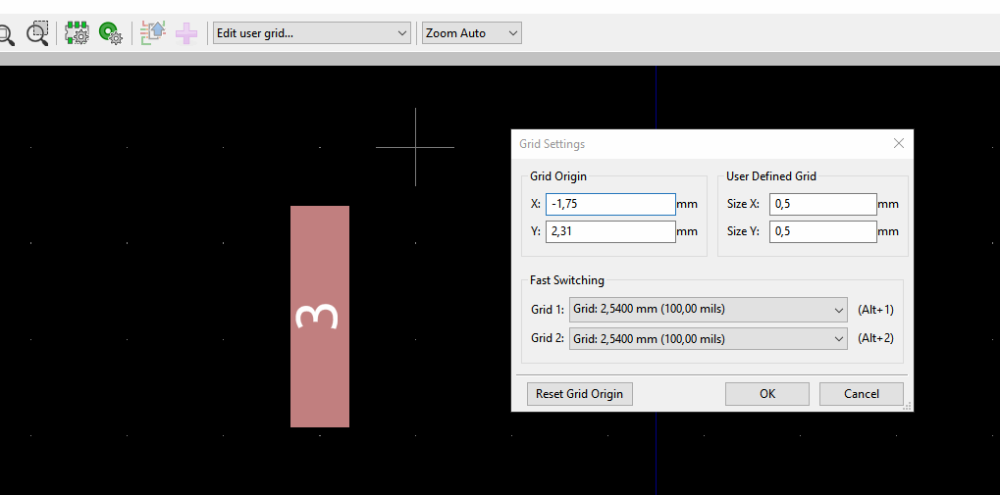

Creating a new footprint:

1. Draw boundary on F.CrtYd (graphic line)
2. Add pads using "Add pad" in the right toolbar.
For more options use their properties page (double click on any pad).
Pos X/Y refers to this pad's center position.
For SMD (and other) pads place a THT connector and change it's settings.
3. Draw silk screen
4. Save the footprint. Create a schematic for the footprint using the Symbol Editor from the main window.
5. "New Symbol" from the toolbar (number of units pp, default unit designator = how many AND gates are in a physical package)
6. Add pins & a box around. Save the symbol / schematic.
7. Close the symbol editor. Open Eeschema. Add the newly saved schematic.
8. "Assign PCB footprints to to schematic symbols." from the top toolbar. Click "Annotate".
9. Select the footprint. Done?

Useful:

 - Select a grid from the dropdown in the top toolbar
 - Offset the grid for fast pad placement:

 - personal preference: boundary aligns with the part, no extra spacing inside the boundary

